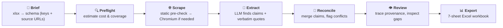

# SEO Content Pipeline <sup>by Ali</sup>

Turns a list of reference URLs into a structured comparison dataset — one row per
product — with every claim traceable back to the page it came from.



## Setup

Requires Python 3.10+ (the code uses PEP 604 unions). A `.venv` is already created here
with Python 3.13.

```powershell
python -m venv .venv
.\.venv\Scripts\python.exe -m pip install -r requirements.txt
.\.venv\Scripts\python.exe -m playwright install chromium   # ~115 MB, one time
```

Then set a key — either copy `.env.example` to `.env` and fill it in, or paste the key
into the sidebar at runtime.

```powershell
.\.venv\Scripts\streamlit.exe run app.py
```

### Docker

```powershell
copy .env.example .env          # fill in your API keys
docker compose up --build
```

Open `http://localhost:8501`.  Named volumes persist the cache, runs, and exports
across rebuilds.

### Streamlit Cloud (streamlit.app)

1. Push the repo to GitHub.
2. On your Streamlit Cloud dashboard, deploy from that repo.
3. Set secrets (API keys) in the app's settings.
4. Once the app loads, click **Install Chromium** in the sidebar — the browser is
   downloaded on demand (~130 MB) and cached across reruns.  Without it, the app
   falls back to static HTTP extraction (works for most pages, misses JS-only content).

The `packages.txt` file installs Chromium's system dependencies automatically.

## Quick start

The content brief already lists the URLs, so a run needs almost no setup:

1. **Schema** → *Import a brief workbook* → pick a sheet → **Import sheet** → **Save to
   disk**. The *General* and *Tools* sheets become separate schemas — they are written in
   different registers and use different system prompts.
2. **Input** → enter the product name → **Seed input from schema**. The URL list is built
   from the brief's own *Source urls*; there is no sheet to prepare.
3. **Run** → read the preflight (calls, rough cost, any field with no source) →
   **Start run**.
4. **Review** the conflicts, then **Export** the workbook.

## Model providers

| Provider | JSON guarantee | Suggested models |
|---|---|---|
| `openai` | strict `json_schema` — enforced by the API | `gpt-5.6-luna`, `gpt-5.6-terra`, `gpt-5.6-sol` |
| `anthropic` | forced tool call | `claude-sonnet-5`, `claude-opus-5`, `claude-haiku-4-5` |
| `deepseek` | loose `json_object` + local validation | **Default.** `deepseek-v4-flash`, `deepseek-v4-pro` |
| `ollama` | loose `json_object` + local validation | Local and free. Weakest on a 17-field schema. |

Any other model name can be typed into the model box; the lists above are only shortcuts.
Each provider remembers its own key, endpoint and model, so switching between them never
sends one provider's credential to another's endpoint.

**Reasoning is the default everywhere now**, and extraction does not benefit from it: the
task is to read a page and fill in fields, not to work a problem out. Reasoning tokens are
billed as output and eat into the same budget as the JSON, so each provider is configured
to spend as little on thinking as its API allows:

- **OpenAI** `gpt-5.x` rejects the deprecated `max_tokens` and ignores `temperature`, so the
  code sends `max_completion_tokens` with `reasoning_effort="low"`.
- **Anthropic** Claude 5 models return a 400 for any non-default `temperature`, so sampling
  is omitted and spend is steered with `output_config.effort="low"` instead.
- **DeepSeek** V4 thinks by default, which silently voids `temperature`. Thinking is turned
  off explicitly, which keeps the whole output budget for the JSON.

If calls start failing with truncated JSON, raise **Max output tokens** or lower the merge
batch size — a reasoning model can consume most of a small budget before it emits any JSON.

**DeepSeek specifics.** The API is OpenAI-compatible (`https://api.deepseek.com/v1`) but
has no strict-schema mode, so the JSON Schema is embedded in the system prompt and
validated locally. When a reply fails validation, the error is fed back and the model is
asked to fix that specific problem, rather than blindly resending the same prompt — which
otherwise tends to reproduce the same malformed output. Embedding the schema costs roughly
1.4k extra prompt tokens per call on this 17-field brief (measured: 5.7k chars).

Prices change often, so treat the built-in cost table as indicative only and check the
current rates before committing to a provider on cost grounds.

## Core idea: the schema is data, not code

The shape of the deliverable lives in `schemas/*.yaml`, not in Python. A content brief
becomes a schema file; a new brief or client never requires a code change. Each field
declares the question that defines it, the shape of the answer, and the sources it is
answered from.

```yaml
- key: pricing_starting_from
  label: Pricing (Starting from)          # exact spreadsheet header
  section: Pricing                        # article H2, presentational
  question: What is the minimum price one can pay to use it meaningfully?
  guidance: Give the lowest recurring paid price with currency and period.
  anchors: Mention the free tier and what it limits.
  shape: short_text                       # short_text | list | prose
  source_urls:                            # the pages that answer this field
    - https://zapier.com/pricing
    - https://tech-insider.org/n8n-vs-zapier-2026/
  custom_input: ""                        # evidence pasted by hand, if any
```

- `source_urls` is the routing mechanism, and it is **many-to-many**: one field cites
  several URLs, and the same URL is cited by several fields.
- `anchors` are angles the brief insists on covering; they reach the model as
  "Must cover". Field-specific rules belong here (or in `question` / `guidance`), not in
  the master prompts.
- `custom_input` is evidence you paste yourself — a forum reply, a note from a call. It
  becomes a source in its own right, with no fetch, and its claims are merged and traced
  like any page.
- `fill_from: entity` copies the product name from the input sheet instead of spending an
  LLM call.
- `shape` drives both the JSON schema sent to the model and how the cell is rendered.

Edit schemas in the **Schema** tab (grid or raw YAML) and save to disk. The tab lints for
duplicate keys and labels, and for fields that have no source at all and would therefore
stay empty.

### Importing the brief

The Schema tab reads the client's data-structure workbook directly:

| Article - H2 | Article - H3 | Key | Prompt | Anchors | Source urls | Custom input |
|---|---|---|---|---|---|---|

H2 and H3 are merged cells in the original, so blanks inherit from the row above. Each
sheet becomes one schema and the **scenario** is taken from the sheet name — a sheet
named `… Tools` gets the tools prompts, anything else gets the general ones.

### Routing: which source answers which field

A URL is **fetched once and extracted once**, and is asked only the questions it was
listed under. Listing one URL under five keys costs one call, not five — in the sample
brief this collapses 13 listed URLs into 10 fetches, and 11 into 7 for the tools sheet.

A URL that is not in the brief (pasted by hand with no `Key` column) is tried against
every field, so nothing is silently skipped.

## Input format

Usually you do not write one: **Seed input from schema** builds it from the brief. When
you do supply a sheet, column names are matched loosely and the URL column is detected by
content, so pasting from a spreadsheet works.

| Product | Key | URL |
|---|---|---|
| Zapier | tool_strengths | https://… |
| Zapier | tool_limitations | https://… |
| Zapier | tool_prising_minimum_cost | https://zapier.com/pricing |

- `Key` names the fields a URL answers. Repeat the URL on several rows, or list several
  keys in one cell separated by commas. Rows sharing a URL are merged into one fetch.
- `Key` is optional. Without it the schema's own `source_urls` decide, and a URL that
  appears nowhere in the schema is tried against every field.
- `Product` is optional — supply a default in the UI if your sheet omits it.
- A legacy `Node` column still works for older schemas that route by node.
- URLs differing only by scheme, `www.`, a trailing slash or a `#fragment` are treated as
  the same page.

## Why it is built this way

**JS rendering is mandatory.** A plain HTTP GET of `n8n.io/pricing` returns navigation
chrome and zero prices. With headless Chromium plus a settle delay we get the whole table
(`$20` Starter, `$50` Pro, `$800` Business).

**Static pre-check saves time.** Before launching the heavy browser, every URL is
fetched with a fast HTTP call.  Pages that serve their content server-side (docs, blog
posts, product pages) skip the browser entirely — only JS-heavy pricing pages and SPAs
pay the Chromium cost.  On a typical 9-URL batch this cuts ~5 browser launches.

Pages that block the browser fall back to static extraction automatically. All nine
sample URLs succeed.

**Subject isolation.** Most reference pages for "alternatives" content are "A vs B"
comparisons, so the dominant accuracy risk is attributing the competitor's traits to your
product. The extraction prompt names the subject repeatedly and forbids describing
anything else.

**One fetch per URL, asked only its own questions.** The brief cites the same page under
several keys, and the naive reading of that is one extraction call per (key, URL) pair.
That is not just more expensive — it makes one page produce several separately-worded
answers to overlapping questions, which then have to be merged back together. Inverting
the map instead means a page is read once and answers all of its keys in a single call.

**Rules live at the level they apply to.** Master prompts hold only what is true for
every field; anything specific to one column goes in that field's question, guidance or
anchors. A rule about quoting prices in a master prompt is dead weight on the fifteen
fields that are not about pricing, and it cannot be changed without affecting them.

**Pasted evidence is a source, not a prompt fragment.** Analyst-supplied text flows
through the same models as a fetched page, so it is merged, cited and quote-checked
identically — rather than being appended to every prompt, where it would leak into
unrelated fields and could not be traced.

**Provenance over convenience.** Extraction runs per source page, not per product, so
every claim keeps its URL. Each claim must carry a verbatim supporting quote, which is
then checked against the page text; an unverifiable quote is flagged in the UI and in the
Claims sheet as a possible invention.

**Conflicts surface instead of blending.** Two sources giving two different starting
prices is a fact about your research, not something to hide by concatenating both into one
cell. Such fields are marked `[CONFLICT]` and listed in Review for a human decision.

**Dedupe never merges different numbers.** Character-similarity dedupe rates "supports 400
integrations" and "supports 500 integrations" as 94% identical and silently destroys one.
Merging is therefore vetoed whenever two candidates contain different numbers.

**Caching, because you will re-run this a lot.** Fetched pages and LLM answers are cached
on disk, keyed on everything that could change the result (URL, model, temperature, and
the prompt text itself). Tuning a question re-runs only the affected fields. Re-running an
unchanged pipeline costs nothing.

**Nothing is lost on refresh.** Every stage writes the full run to `runs/*.json`. There
is no login and nothing is tied to the browser session: runs survive a refresh, a browser
restart and a reboot, and are only lost if those files are deleted. Reopen any past run
from the **Saved runs** tab, which prints the exact folder in use.

## System prompts and scenarios

An alternatives article is written in two registers, so the master prompts come in two
sets and each schema declares which one it uses:

| Scenario | Covers | Emphasis |
|---|---|---|
| `general` | the article's subject product — history, what the platform is, who uses it, where it falls short | plain, checkable narrative |
| `tools` | each alternative it is compared against | never attributing a competitor's traits to the subject; never restating a figure loosely |

Each scenario has a prompt for all three LLM stages — extraction, merge and web check —
edited in the **Advanced** tab. **Save prompts** writes them to `prompts.json`;
**Use without saving** applies them to the current session only, which is the cheap way
to trial a wording. Defaults live in `pipeline/prompts.py`, and a stage left unedited
keeps following the default rather than freezing a copy of it.

Prompts are part of every cache key, so an edit correctly misses the cache and re-runs;
unchanged fields still cost nothing.

## Running

The **Run** tab shows a preflight before spending anything: how many calls, a rough cost,
and — importantly — which schema fields have no source at all. Those cells will be blank,
and it is better to know first.

Stage options let you re-extract without re-fetching, or re-merge without re-extracting.

## Output

The workbook has seven sheets:

| Sheet | Purpose |
|---|---|
| Dataset | One row per product. Paste straight into the client sheet. |
| Dataset (transposed) | Fields as rows — easier to read for wide schemas. |
| QA coverage | Fill rate, empty fields, conflicts, single-source fields per product. |
| Provenance | Every cell with its contributing URLs and merge method. |
| Claims | Every individual claim with its quote and verification status. |
| Pages | Fetch log: method used, character counts, failures. Pasted evidence appears with method `custom-input`. |
| Brief | The schema itself, as documentation — including each field's source URLs, anchors and custom input. |

Review single-source and conflicting fields first — that is where errors concentrate.

## Layout

```
app.py                  Streamlit UI (9 tabs, includes Advanced, Storage and Help)
jobs.py                 background job + pollable progress bus
config.py               settings, resolved from .env then sidebar
schemas/*.yaml          output schemas (the content briefs)
prompts.json            edited system prompts (git-ignored; defaults live in code)
pipeline/
  schema.py             FieldSpec / SchemaSpec, key->URL routing, linting
  brief.py              imports the client's data-structure workbook into a schema
  prompts.py            master system prompts, per scenario, with saved overrides
  models.py             pydantic domain models
  scraper.py            crawl4ai + static pre-check, concurrent
  providers.py          OpenAI / Anthropic / DeepSeek / Ollama
  extractor.py          per-source claim extraction with quote verification
  reconciler.py         cross-source merge, conflict detection, web arbitration
  exporter.py           dataframes and the workbook
  runner.py             input parsing, preflight, orchestration
  cache.py / store.py   disk cache, run persistence + backend routing
  db.py                 SQL run storage (SQLite / Postgres / MySQL)
runs/ data/ output/     artifacts (JSON runs, run database, exports)
Dockerfile              multi-stage build (python:3.13-slim + Chromium)
docker-compose.yml      one-command local deployment
packages.txt            Chromium system deps for Streamlit Cloud
```

## Notes and limits

- DeepSeek and Ollama have no strict JSON schema mode, so the schema goes in the prompt and
  is validated locally with a repair retry. Expect more retries than with OpenAI or
  Anthropic, and weaker results from small local models on a 17-field schema.
- Cost estimates are order-of-magnitude only, from a small hardcoded price table that will
  drift out of date. They ignore prompt-caching discounts, which DeepSeek in particular
  applies aggressively.
- Scraping is polite (one request at a time per domain, 1s delay outside the domain lock)
  but does not consult `robots.txt`. Check that the sites you target permit this.
- Page content genuinely varies between fetches on some sites (A/B tests, geo pricing). The
  cache makes a given run reproducible; clearing it may change results.
- On Streamlit Cloud the Chromium browser is not pre-installed — click the **Install
  Chromium** button in the sidebar when first deploying.  The install persists across
  reruns but may need repeating after an idle shutdown.

## Web conflict resolution

A flagged conflict tells you the sources disagree but not who is right, and the scraped
pages cannot settle it — they are the disagreement. Switch on **Resolve conflicts with
web search** in the sidebar and each conflicting field is taken to the model's hosted
search tool, which checks live pages (the vendor's own site first) and returns a verdict
with citations.

```bash
WEB_CHECK_CONFLICTS=1      # off by default
WEB_CHECK_MAX_SEARCHES=4   # hard cap per conflicting field
```

- Requires OpenAI or Anthropic — DeepSeek and Ollama have no hosted search tool, and the
  toggle is disabled for them.
- Runs only on conflicting fields, so cost tracks disagreement rather than schema size.
  Searches are billed on top of tokens (about $0.01 each).
- A resolved verdict replaces the value and keeps the previous one in
  `value_before_web`; an unresolved or failed one leaves the value untouched and records
  why. The conflict flag stays on either way, so a reviewer can see the cell was
  arbitrated rather than agreed.
- Verdicts are cached, saved with the run, shown in Review and exported in the
  Provenance sheet. *Web-check conflicts only* in the Run tab re-checks a finished run
  without repeating the merge.

## Storage

Runs are saved as JSON under `runs/` by default. The **Storage** tab switches this to a
database — a local SQLite file, or any server SQLAlchemy supports — and can copy existing
runs either way. `both` writes to files and the database at once, so a database outage
still cannot lose a run.

Set it without the UI via environment variables:

```bash
STORAGE_BACKEND=both                                   # files | db | both
DATABASE_URL=postgresql+psycopg://user:pw@host:5432/seo # blank = data/runs.db
```

Servers need their driver installed: `psycopg[binary]` for PostgreSQL, `PyMySQL` for
MySQL (both commented out in `requirements.txt`).

Each run is stored as its exact JSON payload in `runs.payload`, so loading is lossless,
and also flattened into queryable tables — `run_inputs`, `run_pages`, `run_extractions`,
`run_claims`, `run_results`, `run_fields`, `run_warnings` — so anything that speaks SQL
can read the data directly:

```sql
select product, field_key, value, source_count
from run_fields
where run_id = 'run_20260728_225909' and conflict = 1;
```

The Storage tab also downloads the SQLite file or a JSON dump of every run, and restores
from either.

## Second stage (not built)

Sanity/CMS publishing. The reconciled `RunState` — in `runs/*.json` or the `runs` table —
is the natural handoff point: it holds final values plus full provenance, so a publisher
can map fields to a Sanity schema and push documents without re-running extraction.
